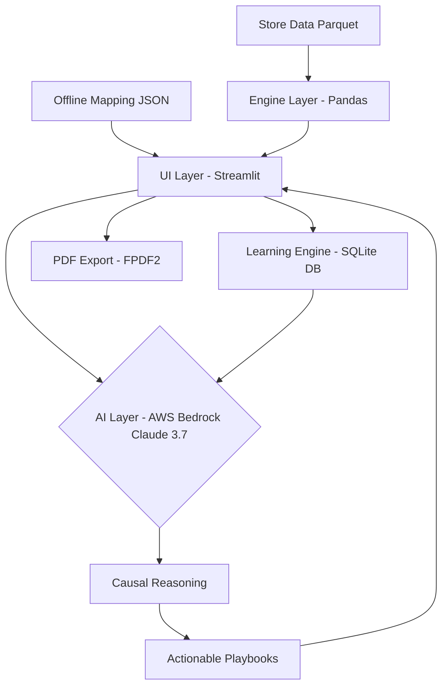

# ZM Copilot | AI Store Performance Decision Engine

**Lenskart Hackathon 2.0 | Problem Statement #26**
👉 **[Live Deployed App: ZM Copilot](https://lenskart-zm-copilot.streamlit.app/)**

ZM Copilot is an enterprise-grade **Autonomous Intelligence Agent** that identifies store performance drivers, generates causal root-cause diagnostics, and produces actionable operational playbooks for Zonal Managers.

📹 **[Watch the 5-Minute Demo Video on Loom](https://www.loom.com/share/30862b02294c4ac18d9b588f37edf9d6)**

---

## 🚀 Setup Instructions (How to Run Locally)

The agent runs locally using Streamlit and connects to AWS Bedrock for AI reasoning.

### Prerequisites
- Python 3.10 or higher
- AWS Account with Bedrock access (Claude 3.7 or Claude 3.5 Sonnet)

### Installation (Run in 3 commands)

1. **Clone & Install Dependencies**
```bash
python -m venv venv
# Windows: venv\Scripts\activate | Mac/Linux: source venv/bin/activate
pip install -r requirements.txt
```

2. **Configure Environment**
```bash
cp .env.example .env
```
*Open `.env` and add your `AWS_ACCESS_KEY_ID` and `AWS_SECRET_ACCESS_KEY`.*

3. **Run the Application**
```bash
streamlit run app.py
```
*The app will automatically open in your browser at `http://localhost:8501`.*

---

## 🔐 Environment Variables

The application requires specific environment variables to interface with AWS Bedrock. 
**Never hardcode secrets into the repository.** Use the `.env.example` file to create your local `.env`.

Required variables:
- `AWS_ACCESS_KEY_ID`: Your AWS IAM access key.
- `AWS_SECRET_ACCESS_KEY`: Your AWS IAM secret key.
- `AWS_REGION`: Defaults to `ap-south-1`.
- `BEDROCK_MODEL_ID_PRIMARY`: ARN of your Claude Bedrock inference profile.

---

## 🏗️ Architecture & Flowchart

The system is built on a decoupled 4-layer architecture, ensuring scalability from mock datasets to real-time enterprise integration.



### The Intelligence Loop
1. **Engine Layer:** Ingests Parquet data, calculates the *Revenue Bridge* (decomposing revenue shifts into Footfall, Conversion, and AOV drivers), and identifies 50+ pre-defined operational anomalies.
2. **AI Layer:** Passes the KPI vector and anomalies to Claude, which acts as a first-principles reasoning engine.
3. **Learning Layer:** The SQLite feedback loop captures ZM ratings (Thumbs Up/Down) to refine playbook recommendations dynamically over time.

---

## 📊 Sample Inputs and Expected Outputs

### Input Vector (Automated from Parquet data)
When a Zonal Manager selects "Store 101", the engine sends the following vector to the AI:
- **Financial Delta:** Revenue -12% | Footfall +5% | Conversion -3.5pp
- **Signal Vector:** `[EYE_TEST_PASSED_BUT_NO_SALE, STAFF_EFFICIENCY_LOW]`
- **Context:** Historical ZM Feedback Success Rate (85%)

### Expected Output (AI Diagnostic generated in < 15s)
```text
STORE HEALTH: CRITICAL (32/100) — Conversion leak at the ET funnel despite strong traffic.

TREND: DECLINING — Revenue is down 12% primarily driven by poor conversion.

ROOT CAUSE: The 5% increase in traffic overwhelmed the floor staff, causing a bottleneck at the "Trending Frames" section post-eye test, leading to a 3.5pp drop in conversion.

REVENUE BRIDGE:
• Footfall Effect: +Rs 15,000 (10% of delta)
• Conversion Effect: -Rs 85,000 (60% of delta)
• AOV Effect: -Rs 42,000 (30% of delta)
→ PRIMARY LEAK: Conversion

CONVERSION DRIVERS:
• High Eye-Test Pass: Positive signal, but failing at product selection.
• Staff Efficiency Drop: Transactions per staff dropped from 8.2 to 5.1.

PLAYBOOK:
1. Reallocate Staff to Floor | Owner: Store Manager | By: Day 1 | Expected: +2% Conv
   -> Move 1 staff member from inventory sorting to the Trending Frames section during peak evening hours.
2. Run Flash Promo | Owner: Marketing | By: Day 2 | Expected: +AOV
   -> Deploy targeted SMS promo for customers who left without buying post-eye test.
   
EXPECTED IMPACT: +2.5% Conv | Rs 1L Monthly Uplift
CONFIDENCE: High — This exact playbook had an 85% success rate in similar historical scenarios.
```

---

## 🤖 AI Reasoning Engine (System Prompt)
The AI is powered by a strict causal reasoning prompt designed for operational finance, ensuring it never hallucinates metrics and strictly attributes revenue leaks mathematically. See `engine.py` for the exact prompt structure.
