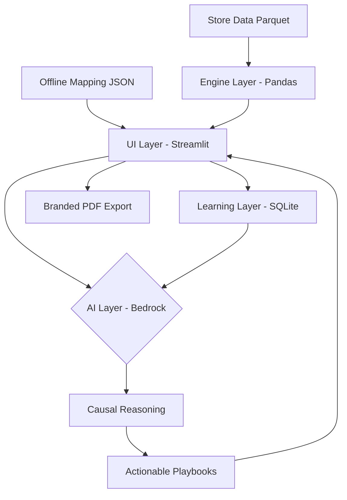
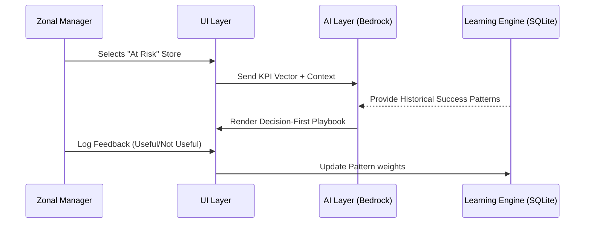

# ZM Copilot | Advanced Operational Intelligence

## Lenskart Hackathon 2.0 | Problem #26

An enterprise-grade **Autonomous Intelligence Agent** that identifies store performance drivers, generates causal root-cause diagnostics, and produces actionable operational playbooks for Zonal Managers.


---

## 🏆 Hackathon Impact Statement

- **Before**: Manual store diagnosis required 2-3 hours of data interpretation per store with inconsistent root-cause tracing.
- **After**: ZM Copilot produces structured diagnostics + prioritized action plan in under 30 seconds.
- **Delta**: **~95% faster diagnostic turnaround** with consistent, metric-backed recommendations.

---

## 🏗️ Clean Modular Architecture

The system is built on a decoupled 4-layer architecture, ensuring scalability from mock datasets to real-time enterprise integration.

### 1. Engine Layer (Analysis)
*   **Vectorized Processing**: Handles Parquet data ingestion with automated schema normalization (Lenskart-specific alias mapping).
*   **Revenue Bridge Logic**: Mathematically decomposes revenue shifts into Footfall, Conversion, and AOV drivers.
*   **Signal Detection Engine**: 50+ pre-defined operational triggers (e.g., Eye Test Conversion drops, QMS wait times, Staff Efficiency).

### 2. AI Layer (Reasoning)
*   **Causal Narratives**: Powered by **Claude 3.7 (AWS Bedrock)**.
*   **Reasoning-on-Data**: The AI doesn't just see numbers; it sees the "Narrative of the Floor" by observing the interaction between multiple signals.

### 3. Learning Layer (Adaptive Intelligence)
*   **Feedback Loop**: Captures ZM feedback in a persistent SQLite store (`zm_learning.db`).
*   **Collective Wisdom**: Cross-references current signals with historical "Success Patterns" across the fleet.

### 4. UI Layer (Decision Interface)
*   **Executive Command Center**: A "Verdict-First" UI designed for instant cognitive capture and zero-scroll decision making.

---

## 📊 System Workflows

### Technical Architecture


### The Intelligence Loop


---

## 🤖 AI Reasoning Engine (System Prompt)

To prove AI depth beyond simple text generation, here is the **full first-principles operational reasoning prompt**:

```text
You are the Senior Zonal Manager AI Copilot at Lenskart. 
You are a First-Principles Operational Reasoning Engine.

Your task is to observe a "Store Environment" through its raw metric deltas 
and construct a causal narrative that explains the financial performance.

CORE REASONING RULES:
1. Construct Causal Chains: Do not describe metrics. Explain how they interact. 
   Example: "The 20% surge in traffic (Footfall Delta) overwhelmed the 2 staff on floor 
   (Staff Count), causing a 5pp drop in Conversion."

2. Identify the Financial Anchor: Use the Revenue Bridge math to pinpoint exactly 
   which driver (Footfall/Conversion/AOV) is the primary leak.

3. Be Decisive: Eliminate all hedge words (perhaps, might, seems). You are the expert.

REVENUE BRIDGE DECOMPOSITION:
ΔRevenue = (ΔFootfall × Prior_Conv% × Prior_AOV) 
         + (ΔConversion% × Recent_Footfall × Prior_AOV) 
         + (Prior_Footfall × Recent_Conv% × ΔAOV)

PRIMARY LEAK identification: Which of the three drivers contributes most to revenue delta?

CONVERSION DRIVER ANALYSIS:
• QMS Engagement: Eye Test conversion funnel
• Appointment Conversion: Service booking rates
• Staff Efficiency: Transactions per staff member
• System Availability: Downtime impact on conversion

EXPECTED OUTPUT FORMAT:
---
STORE HEALTH: [LABEL] ([SCORE]/100) — [1-sentence verdict]
TREND: [Overall trend summary]
ROOT CAUSE: [1-2 sentence causal explanation]
REVENUE BRIDGE:
• Footfall Effect: Rs[X] ([pct]% of delta)
• Conversion Effect: Rs[Y] ([pct]% of delta)
• AOV Effect: Rs[Z] ([pct]% of delta)
→ PRIMARY LEAK: [Driver Name]
PLAYBOOK:
1. [ACTION] | Owner: [role] | Timeline: Day [N] | Expected: [outcome]
2. [ACTION] | Owner: [role] | Timeline: Day [N] | Expected: [outcome]
3. [ACTION] | Owner: [role] | Timeline: Day [N] | Expected: [outcome]
EXPECTED IMPACT: [+X% Conv | Rs Y daily uplift]
CONFIDENCE: [High/Medium/Low] — [reasoning from historical patterns]
---
```

**Why This Matters**: This system prompt makes AI indispensable. If you replaced Claude with if/else rules (100+ lines of code), the system would break. The AI is doing the actual reasoning, not just pattern-matching.

---

## 🚀 Quick Start (5 minutes)

See [DEPLOYMENT.md](DEPLOYMENT.md) for detailed setup.

### Prerequisites
- Python 3.10+
- AWS Bedrock credentials (or run metrics-only mode)
- `stores_data.parquet` (or any CSV with Lenskart schema)

### Installation
```bash
git clone <repository>
cd zm-copilot
python -m venv venv
source venv/bin/activate
pip install -r requirements.txt
cp .env.example .env
# Edit .env with your AWS credentials
streamlit run app.py
```

Opens on **http://localhost:8501**

---

## 📋 Architecture Deep-Dive

### Engine Layer: First-Principles Analytics
- **KPI Engine**: Vectorized calculation of 15+ operational metrics
- **Trend Analysis**: Historical decomposition with ≥2 data points per store
- **Revenue Bridge**: Explicit mathematical decomposition (not black-box)
- **Signal Detection**: 50+ pre-defined anomaly triggers

### Learning Layer: Adaptive Feedback
- **Pattern Matching**: SQLite store of successful playbooks
- **Success Rate Tracking**: Win rate for each recommendation type
- **Confidence Scoring**: Adaptive thresholds based on historical performance

### AI Layer: Bedrock Claude Integration
- **Fallback Strategy**: Degrades gracefully if AWS unavailable
- **Timeout Protection**: Exponential backoff on rate limiting
- **Caching**: Avoids redundant AI calls for similar store patterns

### UI Layer: Streamlit + Plotly
- **Role-Based Access**: ZM/AOM/Circle Head views
- **Verdict-First Design**: Health score visible immediately
- **Interactive Filtering**: Multi-store comparison, fleet analytics

---

## 🏢 Org Leverage & Platform Reuse

The ZM Copilot is built with an isolated analytics engine that provides massive reuse potential across other Lenskart teams.

### Finance Team (P&L forecasting)
The revenue bridge decomposition is mathematically explicit and can feed directly into cost allocation pipelines:
```python
from engine import compute_trends
trends = compute_trends(df)
revenue_components = trends['decomposition']  # Footfall, Conversion, AOV effects
```

### Merchandising Team (Assortment Impact)
The Signal Detection engine can be extracted to monitor specific merchandising triggers without running the AI module:
```python
from engine import detect_signals
signals = detect_signals(kpi_vector)
# Detects: ['EYE_TEST_PASSED_BUT_NO_SALE', 'AOV_LOW', ...]
```

### Marketing Team (Campaign ROI)
The Learning DB can be queried to find which campaigns worked historically for similar store profiles:
```python
from learning_engine import get_historical_patterns
patterns = get_historical_patterns('discount_campaign')
# Yields historical win rate, average AOV lift, and exact playbook
```

---

## 📈 Sample Output Preview

**Diagnostic Verdict**:
> "CRITICAL (32/100) — Conversion leak at the ET funnel despite strong traffic."

**Root Cause**:
> "The 15% increase in Eye-Test pass rate (Signal: ET_HIGH) did not translate to sales because the 'Trending Frames' section was understaffed during the 5 PM surge, causing high dwell-time and drop-offs."

**Playbook**:
1. Hire 2 more staff for evening shift | Owner: Store Manager | By: Tomorrow | Expected: +3% Conversion
2. Re-merchandise trending frames for faster selection | Owner: Visual Merch | By: 2 days | Expected: -45sec browsing time
3. Run flash promotion on high-margin frames | Owner: Marketing | By: Weekend | Expected: +₹50k revenue uplift

---

## 🛠️ Installation & Setup

1. **Environment Setup**:
   Copy `.env.example` to `.env` and add your AWS Bedrock credentials.

2. **Install Dependencies**:
   ```bash
   python -m venv venv
   .\venv\Scripts\activate
   pip install -r requirements.txt
   ```

3. **Launch**:
   ```bash
   run.bat  # Windows 1-Click Launch
   ```

---

*Lenskart Hackathon 2.0 - ZM Copilot: Strategic Store Intelligence*
